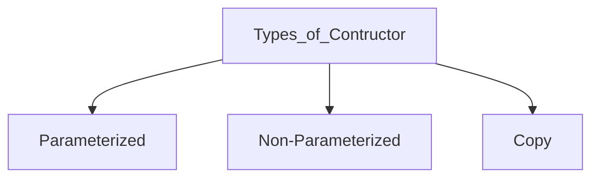

# Object Oriented Programming (OOP)
- A programming paradigm, based on the concepts of objects and classes.
- The data is represented as fields (often called **attributes** or **properties**), and the code is represented as **procedure** (often called **methods**).
- **Objects** are instances of classes, which act as blueprints for creating real world entities. 
---

#### Use Cases:
1. High Modularity
2. High Code Reusablity
3. High Security
4. Uses bottom - up approach
5. High Scalability
---

#### `OOP` v/s `POP`
|Feature|OOP|POP|
|:-:|:-:|:-:|
|**Name**|Object Oriented Programming|Procedural Oriented Programming|
|**Focus**|Objects & Data|Functions & Procedures|
|**Data Handling**|Data is hidden & protected (encapsulation)|Data is global & shared|
|**Modularity**|Code is organised into classes & objects|Code is organized into functions|
|**Reusablity**|High|Low|
|**Scalability**|High|Low|
|**Complexity**|High|Low|
|**Appproach**|Bottom - up|Top - down|
|**Security**|High|Low|
|**Example**|`C++`, `Java`|`C`, `Pascal`|
---

#### Classes
- A blueprint or template for creating / calling objects.
- It is the logical representation that defines a set of attributes (data) & methods (function) that the objects created from the class will have.
- Does not occupy any memory on its own.

```python
class Employee:
    def __init__(self):
        # Attributes
        self.employee_name = "" # public
        self._id = ""           # protected
        self.__salary = 0       # private
    
    # Methods to follow (Behaviour)

    def setName(self, name):
        self.employee_name = name

    def setId(self, id):
        self._id = id
    
    def setSalary(self, salary):
        self.__salary = salary
    
    def getName(self):
        return self.employee_name

    def getId(self):
        return self._id
```
---

#### Objects
- An instance of a class.
- When an object is created from a class, memory is allocated for it, and it holds the data as specified by the class.
- It interacts with the other parts of the program, and methods can be called & attributes are accessed that belong to it.

```python
obj = Employee()

obj.setName("Tushar")
obj.setId("abc1234")
obj.setSalary("7 crore")

print(f"Id: {obj.getId()}, Name: {obj.getName()}, Salary: {obj.getSalary}")
```
Output: 
```text
Id: abc1234, Name: Tushar, Salary: 7 crore
```
---


#### Attributes (properties or fields)
- Data or charecterstics of an object.
- Represent state of an object at any given moment.
- Typically defined within a class & can hold different types of information related to the object.
- Also called as `Instance Variables` & are unique.
---

#### Behaviours (methods or functions)
- Actions or operations that an object can perform & are defined in a class.
- Define how the object interacts with its environment or other objects.
- Implemented in methods.
- Represent the functionality of the object.
---

#### Self (keyword)
- Similar to `this` pointer in `C++` or `this` reference in `Java`
- Whenever we call an instance method using an object, address of the object gets passed to the method implicity. The address is collected by the instance method in a variable called `self`
- In place of `self` any other variable name can be used
---

#### Creating a new object
- `__init__()` is invoked automatically whenever, an object is created, whether it is mentioned or not in class description i.e. `constructor`
- It is invoked only `once`
- Object is created in `heap memory`
- `obj = <className>()`
- `__init__()` gurantees initialization & does not return any value
- `Reference` is stored in `stack memory`, because local variable are stored in stack.
---

#### Deletion of an object
- `__del__()` is similar to destructor function
- It gets called automatically when an object goes out of scope. Cleanup activity, if any, should be done in `__del__()`
---

#### Buit - in class methods
1. `vars()`: returns a dictionary of attributes and their values
2. `dir()`: returns a list of attributes
3. `getattr(obj, name, [, default])`: to check if an attribute exists or not 
4. `setattr(obj, name, value)`: to set an attributem if an attribute not exists, then it would be created
5. `delattr(obj, name)`: to delete an attribute
---

#### Built - in class attributes
1. `__dict__`: dictionary containing the class namespace
2. `__name__`: class name
3. `__doc__`: class documentation string or `None` if undefined
4. `__module__`: module name in which the class is defined. This attribute is `__main__` in the interactive mode
5. `__bases__`: a possibly empty tuple containing the base classes, in the order of their occurence in the base class list
---

#### Constructor
- A special method in a class designed to initialize an object when it is created
- It ensures that the object is set up with the required attributes and state before it is used
- It is a method that has the exact same as the class and does not have a return type (not even `void`)
- It is called when an object is created. This justifies why the above code snippets gives the shown output
- If there is no constructor written for the given class, the language by default triggers the default constructor.



```python
class Employee:
    def __init__(self):
        self.employeeName = "Tushar Khanna"
        self._salary = 50000
    
    def setName(self, name):
        self.employeeName = name
    
    def setSalary(self, val):
        self._salary = val
    
    def getSalary(self):
        return self._salary
    
if __name__ == "__main__":
    obj = Employee()
    print("Default values initialized by constructor")
    print(f"Employee Name: {obj.employeeName}")
    print(f"Salary: Rs.{obj.getSalary()}")
```
Output:
```text
Default values initialized by constructor
Employee Name: Tushar Khanna
Salary: Rs.50000
```